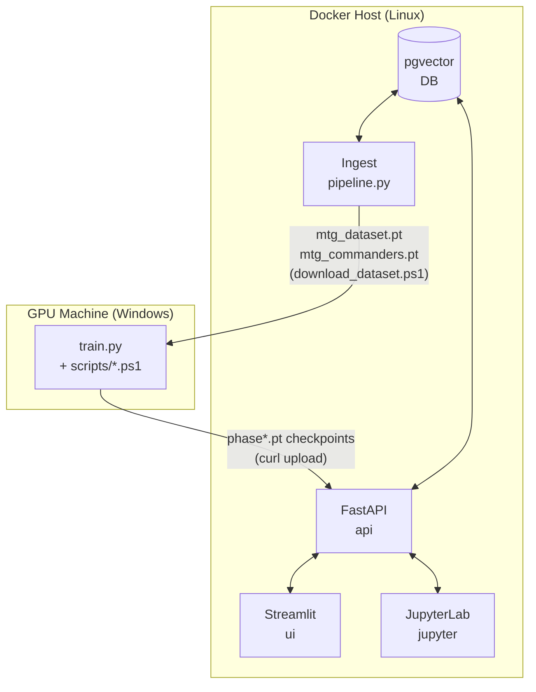
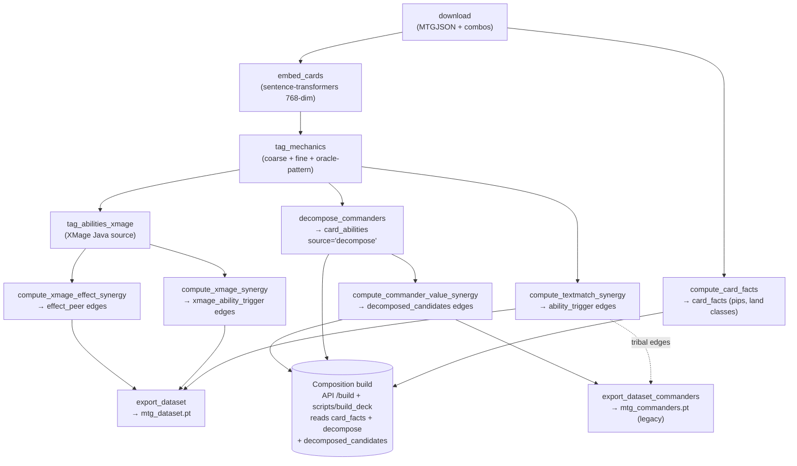
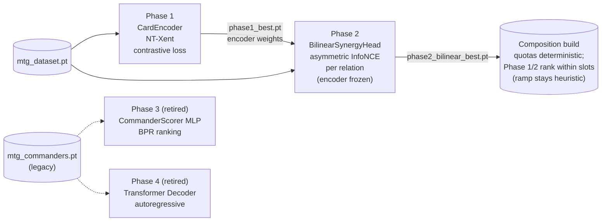

# MTG Commander AI — Project Guide

## What this project is

A PyTorch system that builds 99-card Commander decks given a single commander
card.  The goal is *model-discovered* decklists, not reproductions of human
lists — human decks are training signal, not output target.

**The architecture is composition-first** (since PR #132): deterministic
quotas derived from the commander (lands / ramp / draw / interaction /
protection / theme, each with a "because" rationale) form the skeleton;
learned models (Phase 1 encoder + Phase 2 bilinear head) only rank candidates
*within* each quota.  Phases 3/4 are retired (#151).

Session bootstrap — read these for current context:
- `docs/composition-first-plan.md` — the architecture (W1–W6, all complete)
- `docs/composition-next-steps.md` — active backlog; tracked in GitHub epic #156
- `scripts/eval_harness.py` — the regression gate for any composition change

## Repository layout

```
mtg-pytorch/
├── docker-compose.yml          # All services; uses traefik-public network
├── .env.example                # Copy to .env and fill in secrets
├── data/
│   └── migrations/
│       └── 001_init.sql        # Schema: cards, embeddings, synergy_edges, decks
├── services/
│   ├── api/                    # FastAPI — card search, similarity, deck generation
│   ├── ingest/                 # Pipeline: MTGJSON → pgvector embeddings
│   │   ├── pipeline.py         # Stage orchestrator — accepts --stage flag
│   │   ├── stages/             # Focused stage modules (pipeline.py delegates here)
│   │   │   ├── db.py           #   Shared engine, Session, SYNERGY_CHUNK constants
│   │   │   ├── download.py     #   Fetch MTGJSON/Scryfall + load cards + import combos
│   │   │   ├── facts.py        #   compute_card_facts — Layer-1 facts → card_facts table
│   │   │   ├── tag.py          #   embed_cards
│   │   │   ├── mechanics.py    #   tag_mechanics — canonical role tagger (coarse + fine + oracle-pattern)
│   │   │   ├── dataset.py      #   compute_textmatch_synergy + compute_xmage_synergy + compute_xmage_effect_synergy
│   │   │   ├── commander.py    #   compute_commander_value_synergy
│   │   │   ├── decompose.py    #   decompose_commanders — ORACLE_PATTERNS + _detect()
│   │   │   └── export.py       #   Thin wrappers for all export sub-stages
│   │   └── scripts/            # User-facing scripts (export, import, eval)
│   │       ├── export_dataset.py           #   Build mtg_dataset.pt (Phases 1–2)
│   │       ├── export_dataset_commanders.py #   Build mtg_commanders.pt (legacy, Phases 3–4)
│   │       ├── export_db_helpers.py        #   Shared DB loading utilities
│   │       ├── eval_decomposition.py       #   Spot-check decompose output; --no-signals gap list
│   │       ├── eval_profile.py             #   Derived quota profile for a commander
│   │       ├── build_deck.py               #   Composition build (heuristic or --ranking=model)
│   │       ├── eval_harness.py             #   W6 regression gate (golden 20 commanders, exit 0/1)
│   │       ├── import_moxfield.py          #   Batch Moxfield .txt deck imports
│   │       ├── import_decklists.py         #   cardtrak JSON export imports
│   │       └── import_spellbook.py         #   Commander Spellbook combo imports
│   ├── jupyter/                # Lightweight JupyterLab image (CPU, no training deps)
│   └── ui/                     # Streamlit interface
├── shared/                     # Mounted at /shared (PYTHONPATH) in api, ingest, jupyter
│   ├── composition/            # Composition engine — pure Python, no DB/torch deps
│   │   ├── card_facts.py       #   Layer-1 parsing: pips, land classes, MDFC
│   │   ├── profile.py          #   Quota derivation per commander (+ "because" strings)
│   │   ├── karsten.py          #   Hypergeometric castability math
│   │   ├── goldfish.py         #   Monte Carlo castability simulator
│   │   ├── builder.py          #   Quota fill + mana base + feedback loop
│   │   ├── models.py           #   CANONICAL CardEncoder + BilinearSynergyHead (#152; torch)
│   │   ├── ranking.py          #   Phase 1/2 checkpoint loader, in-slot ranking (lazy torch)
│   │   ├── evaluation.py       #   Hard invariants + human-range checks (harness core)
│   │   └── pool_helpers.py     #   DB-row → card dict, staple pool SQL map
│   └── mtg_sql/                # Staple SQL fragments (ramp, removal, protection, …)
├── models/                     # (unused legacy dir — canonical classes: shared/composition/models.py)
├── notebooks/                  # Jupyter notebooks (mounted into jupyter service)
└── mage/                       # XMage reference: Java rules engine (read-only)
```

## Services

| Service   | Purpose                                      | External URL (via Traefik) |
|-----------|----------------------------------------------|----------------------------|
| `db`      | pgvector/pgvector:pg16                       | internal only              |
| `api`     | FastAPI REST API                             | `$API_HOST`                |
| `ui`      | Streamlit deck builder + generated deck history | `$UI_HOST`              |
| `jupyter` | JupyterLab for research and inference        | `$JUPYTER_HOST`            |
| `ingest`  | One-shot MTGJSON → DB pipeline               | internal only              |



## Development workflow

```bash
# 1. Bootstrap
cp .env.example .env      # edit POSTGRES_PASSWORD, hosts, ADMIN_TOKEN

# 2. Start services
docker compose up -d db api ui jupyter

# 3. Download card data + combos (MTGJSON → cards table + Commander Spellbook)
#    Re-run when new sets release or combo data changes.  Fast — no ML work.
docker compose run --rm ingest python pipeline.py --stage download

# 4. Process: embed, tag abilities, compute synergy edges, export artifact
#    Requires download to have been run first.  Takes ~30–60 min.
docker compose run --rm ingest python pipeline.py --stage process

# 3+4 combined (full pipeline, same as default):
docker compose run --rm ingest

# Individual sub-stages (useful after code changes or partial failures):
docker compose run --rm ingest python pipeline.py --stage compute_card_facts   # Layer-1 card facts (pips, land classes) → card_facts table
docker compose run --rm ingest python pipeline.py --stage embed_cards
docker compose run --rm ingest python pipeline.py --stage tag_mechanics
docker compose run --rm ingest python pipeline.py --stage tag_mechanics --rescan   # delete + re-insert all oracle_text/card_characteristic role rows
docker compose run --rm ingest python pipeline.py --stage tag_abilities_xmage          # supplement with XMage source parsing (requires mage/ mount)
docker compose run --rm ingest python pipeline.py --stage compute_textmatch_synergy
docker compose run --rm ingest python pipeline.py --stage compute_xmage_synergy
docker compose run --rm ingest python pipeline.py --stage export_dataset

# Commander decompose pipeline — ALSO REQUIRED by the composition build path:
# the API reads card_abilities (source='decompose') for quota derivation and
# decomposed_candidates synergy_edges for theme pools.  After ANY change to
# ORACLE_PATTERNS (stages/decompose.py) or consumer SQL
# (synergy/commander_mechanics.py), re-run BOTH stages below or the API
# serves stale signals (staleness check tracked in #137):
#   docker compose run --rm ingest python pipeline.py --stage decompose_commanders
#   docker compose run --rm ingest python pipeline.py --stage compute_commander_value_synergy  # ~30 min
# These stages are NOT part of process — run them explicitly.

# Step 0: write decompose signals to card_abilities (source='decompose')
#   prerequisite for export_dataset_commanders; also fixes the UI decompose panel.
docker compose run --rm ingest python pipeline.py --stage decompose_commanders

# Step 1: commander-value synergy edges
# (tribal edges are built by compute_textmatch_synergy via commander_mechanics.py)
docker compose run --rm ingest python pipeline.py --stage compute_commander_value_synergy

# Step 2: export artifact (reads card_abilities instead of calling _detect directly)
docker compose run --rm ingest python pipeline.py --stage export_dataset_commanders

# Composition engine (docs/composition-first-plan.md) — profile + deck builds:
docker compose run --rm ingest python -m scripts.eval_profile "Wilhelt"                # derived quota profile
docker compose run --rm ingest python -m scripts.build_deck "Wilhelt"                  # heuristic baseline build (W3)
docker compose run --rm ingest python -m scripts.build_deck "Wilhelt" --ranking=model  # Phase 1/2 model-ranked build (W4)

# Regression harness (W6): golden 20-commander set — hard invariants (99 cards,
# singleton, color identity, quota audit, castability gate) + human-deck quota
# range comparison.  Exit code 0/1 — run before merging composition changes.
docker compose run --rm ingest python -m scripts.eval_harness                  # ~5 min, model ranking
docker compose run --rm ingest python -m scripts.eval_harness --ranking heuristic
docker compose run --rm ingest python -m scripts.eval_harness --commanders "Wilhelt" --json

# Spot-check the decomposition output with eval_decomposition:
docker compose run --rm ingest python -m scripts.eval_decomposition "Anje Falkenrath"         # named lookup (partial match)
docker compose run --rm ingest python -m scripts.eval_decomposition --no-signals              # list commanders with zero signals (gap analysis)
docker compose run --rm ingest python -m scripts.eval_decomposition --key goad                # evaluate a specific pattern key
docker compose run --rm ingest python -m scripts.eval_decomposition "Anje" --limit 0          # remove per-key card cap (default 10)

# 5. Restart API to clear in-process embedding cache
docker compose restart api

# 8. Rebuild pgvector index for full recall quality
docker compose exec db psql -U mtg -d mtg -c \
  "REINDEX INDEX CONCURRENTLY idx_card_embeddings_ivfflat;"

# 9. Open UI
open https://$UI_HOST
```

### Ingest pipeline stages



`download` + `compute_card_facts` + `embed_cards` + `tag_mechanics` + synergy stages + `export_dataset` are all run by `--stage process`.  The commander decompose stages (`decompose_commanders`, `compute_commander_value_synergy`) must be run explicitly after `process` — **and re-run after any decompose pattern / consumer SQL change**, since the composition build path reads their DB output.  `export_dataset_commanders` is legacy (retired Phases 3–4).

### Embedding model

The embedding model must match between ingest and the trained checkpoint.
Current model: `sentence-transformers/all-mpnet-base-v2` (768-dim).
Set via `EMBEDDING_MODEL` in `.env` — must match `.env.example`.

If you ever need to switch models, delete the old rows first:
```bash
docker compose exec db psql -U mtg -d mtg -c \
  "DELETE FROM card_embeddings WHERE model = '<old-model-name>';"
docker compose exec db psql -U mtg -d mtg -c \
  "ALTER TABLE card_embeddings ALTER COLUMN embedding TYPE vector(<new-dim>);"
# then re-run ingest
```

## Two-environment setup

The system is split across two machines that must stay in sync:

| | GPU machine (training) | Docker host (serving) |
|---|---|---|
| **OS** | Windows (native, no Docker) | Linux |
| **Purpose** | Train the model | Host API, UI, DB |
| **Key files** | `services/trainer/train.py`, `scripts/*.ps1` | `docker-compose.yml`, `services/api/` |
| **docker-compose** | Not used | Primary entrypoint |
| **Setup doc** | `docs/windows-non-docker-setup.md` | This file |
| **Data source** | Downloads `mtg_dataset.pt` artifact from Docker host | Runs ingest to populate DB |
| **Output** | `.pt` checkpoint file | Serves deck generation via API |

### Sync requirements

These two must always agree or deck generation will silently fail:

- **Embedding model** — the artifact's `meta.model` field records which model was
  used.  The `input_dim` of `CardEncoder` in any checkpoint must match `meta.dim`.
  Current: `sentence-transformers/all-mpnet-base-v2` (768-dim).

- **Card universe** — if ingest is re-run on the Docker host (e.g. after a MTGJSON
  update), re-export the artifact and re-download it on the GPU machine before
  the next training run.

### Workflow for updating the model

1. Run full ingest on the Docker host (produces a fresh `mtg_dataset.pt`).
2. Import new decklists if any, then re-export: `docker compose run --rm ingest python pipeline.py --stage export_dataset`
3. On the GPU machine, download the artifact:

```powershell
.\scripts\download_dataset.ps1
```

4. Train the live phases (3/4 are retired — #151):

```powershell
.\scripts\run.ps1 -Mode train -Phase 1 -Dataset .\ingest_cache\mtg_dataset.pt
.\scripts\run.ps1 -Mode train -Phase 2 -Dataset .\ingest_cache\mtg_dataset.pt   # bilinear (default)
```

Phase 2 trains `BilinearSynergyHead` (saves `phase2_bilinear_best.pt`) with the
encoder frozen at `phase1_best.pt`.  The composition build path loads the
encoder from `phase2_best.pt`, falling back to `phase1_best.pt`
(`shared/composition/ranking.py`).  Upload both checkpoints after training:

5. Upload checkpoints to the Docker host via the UI, or:

```bash
# Phase 1 encoder (fallback encoder for composition ranking)
curl -X POST https://$API_HOST/admin/checkpoint \
  -H "x-admin-token: $ADMIN_TOKEN" \
  -F "file=@phase1_best.pt" \
  -F "name=phase1_best"

# Phase 2 bilinear head (in-slot ranking for the composition builder)
curl -X POST https://$API_HOST/admin/checkpoint \
  -H "x-admin-token: $ADMIN_TOKEN" \
  -F "file=@phase2_bilinear_best.pt" \
  -F "name=phase2_bilinear_best"
```

The API hot-swaps the model immediately (no restart needed).

Checkpoint files live in the `model_checkpoints` Docker volume, mounted at
`/app/checkpoints` in the API and `/checkpoints` in Jupyter (read-only).

## Training progression

**Status:** Phases 1–2 are the live learned components (within-slot ranking
for the composition builder).  Phases 3–4 are **retired** (#151) — deck-level
structure is computed by the composition engine, not learned.  Their
documentation remains for checkpoint archaeology.

The model is trained in four phases, each building on the last:

1. **Text equivalence** — contrastive loss on card embeddings; same-oracle-id
   reprints are positive pairs.  Baseline: cards with identical rules text
   should be nearest neighbours.

2. **Relational bilinear scoring** — learns one weight matrix W_r per relation
   type (`effect_peer`, `ability_trigger`, `combo`, `decomposed_candidates`).
   The Phase 1 encoder is **frozen**; only the W_r matrices move.  Score:
   `score(A, B, r) = A^T W_r B`.  Trained with asymmetric InfoNCE per relation.
   Replaces the previous NT-Xent formulation which corrupted Phase 1 geometry
   by conflating complementary relations (producer→consumer, combo) with
   similarity relations (functional peers).

3. **Commander-card ranking** — BPR loss on the commanders artifact: given a
   commander, rank its synergy-positive cards above random legal cards.
   Trains `CommanderScorer` (a joint MLP over `[z_cmd; z_card]`) on top of
   the frozen Phase 1 encoder.  Adds per-commander non-linear discrimination
   that the Phase 2 bilinear head cannot represent (W_r is a single global
   matrix; the MLP sees each commander–card pair jointly).  **Empirically
   validate** that Phase 3 re-ranks the top-20 candidates differently from the
   bilinear head alone before treating it as load-bearing — if the candidate
   pre-filter and bilinear signal are already tight, Phase 3 may provide
   diminishing returns.

4. **Generative deck construction** — transformer decoder; given commander +
   partial deck, predict next card.  Sampled freely at inference — not greedy.
   The only phase that models deck-level coherence: no scoring function over a
   fixed (commander, card) pair can account for what is already in the deck.



## Key data sources

- **MTGJSON AtomicCards** (primary) — https://mtgjson.com/downloads/ — full
  machine-readable card data, no rate limits.  The ingest pipeline downloads
  `AtomicCards.json.gz` automatically and caches it in the `ingest_cache`
  volume.  Re-downloaded only when the MTGJSON version changes.
- **Scryfall** (fallback only) — used if MTGJSON is unavailable.  Do **not**
  hit the Scryfall API in a loop; their rate limits are strict.
- **XMage (`mage/`)** — Java reference implementation; 31 k+ files, 246 keyword
  abilities, 269 common ability patterns, full game-state engine.  Use it to
  extract structured ability information that MTGJSON keywords don't cover.
- **Moxfield** — user-curated Commander decklists exported as `.txt` files.
  Drop exports into a folder and run `import_moxfield.py` (see below).
- **cardtrak** — internal collection tracker; decklists exported via
  `ml_decklists` view and imported with `import_decklists.py`.

## Database schema (key tables)

| Table              | Purpose                                      |
|--------------------|----------------------------------------------|
| `cards`            | Oracle card data from MTGJSON/Scryfall       |
| `card_facts`       | Layer-1 composition facts: pip counts, land classification (see `shared/composition/`) |
| `card_embeddings`  | Per-model vector embeddings (pgvector)       |
| `card_abilities`   | Structured ability tags (keyword/triggered)  |
| `synergy_edges`    | Pairwise synergy scores, multiple score types|
| `decks`            | Commander decklists (synthesized training data) |
| `generated_decks`  | Model output decks, one row per inference    |

## Conventions

- **Python 3.12** everywhere in Python services.
- **SQLAlchemy async** with `asyncpg` in API and ingest; sync `psycopg2` in
  trainer (PyTorch DataLoader workers are synchronous).
- Embeddings dimension is **768** (all-mpnet-base-v2).  If you change the
  model, update the `vector(768)` column in the migration and add a new `model`
  row in `card_embeddings` — do not alter existing embeddings.
- The `ingest` service runs to completion (`restart: "no"`).  Restart manually
  with `docker compose run --rm ingest`.
- Traefik TLS is handled externally; services only need the labels already in
  `docker-compose.yml`.  Do not add TLS config inside containers.
- The `traefik-public` network is declared `external: true`.  Docker Compose v5
  requires the network to exist before `docker compose up` — it is created and
  managed by the Traefik stack, not this project.
- Never commit `.env`; only commit `.env.example`.

## Training notes

See [`docs/training-notes.md`](docs/training-notes.md) for: Phase 2 loss benchmarks, Phase 4 encoder stability settings, land embedding invalidation procedure, training artifact reference, commander artifact details, and the full Phase 2 bilinear relation type guide (relation semantics, training flow, updating pairs, adding new relations).

---

## UI tabs

The Streamlit UI (`services/ui/app.py`) has two tabs:

| Tab | Purpose |
|-----|---------|
| **Deck Builder** | Search for a commander; **Composition build** section (POST `/commanders/{oracle_id}/build`, model or heuristic ranking) renders the quota table with "because" strings, goldfish metrics, theme density, and slot breakdown.  (The CommanderScorer candidate table and checkpoint picker were removed in #151.) |
| **Generated Decks** | Browse and inspect all previously generated decks (composition decks include the full composition block).  Auto-selects the most recently generated deck when navigating from the builder. |

The `app.py` is **baked into the Docker image** — changes require a rebuild:

```bash
docker compose build ui && docker compose up -d ui
```

### Generated deck persistence

Completed decks are saved as timestamped JSON files under `DECK_SAVE_DIR`
(default `/app/generated_decks` inside the API container, backed by the
`generated_decks` Docker volume).  Two API endpoints expose this history:

| Endpoint | Description |
|----------|-------------|
| `GET /decks/generated` | List saved decks (newest first): filename, commander, checkpoint, card count |
| `GET /decks/generated/{filename}` | Fetch full deck JSON by filename |

The job result for `GET /decks/jobs/{job_id}` includes a `deck_filename` field
once the job is complete, so the UI can deep-link directly to the saved file.

---

## Evaluation scripts (GPU machine, no DB required)

All eval scripts load from the training artifact — no database connection needed.

### `eval_neighbors.ps1` — nearest-neighbour spot-check

Verifies Phase 1 checkpoint quality by projecting all card embeddings through
the trained `CardEncoder` and printing the top-N nearest neighbours for a
given card.  Use this to confirm that functionally equivalent cards cluster
together after training.

```powershell
.\scripts\eval_neighbors.ps1 "Swords to Plowshares"
.\scripts\eval_neighbors.ps1 "Llanowar Elves" -Top 30
```

| Parameter | Default | Description |
|-----------|---------|-------------|
| `-Card` | (required) | Card name — partial/case-insensitive match |
| `-Top` | `20` | Number of neighbours to display |
| `-Checkpoint` | `phase1_best` | Override checkpoint name |
| `-Dataset` | `ingest_cache\mtg_dataset.pt` | Override artifact path |

**Expected results (Phase 1 success criteria):**
- Swords to Plowshares → Path to Exile, Generous Gift (removal cluster)
- Llanowar Elves → Birds of Paradise, Elvish Mystic, Fyndhorn Elves (ramp cluster)


---

## XMage as a training signal

See [`docs/xmage-signal.md`](docs/xmage-signal.md) for: how `xmage_parse.py` works, `ABILITY_CLASS_TO_EVENT` mapping, body-scan refinements, and the `SpellCastControllerTriggeredAbility` per-spell-type bucket breakdown.

---

## Commander decomposition (`stages/decompose.py`)

See [`docs/commander-decomposition.md`](docs/commander-decomposition.md) for the full reference: signal sources, the complete pattern library, spot-check commands, and instructions for adding new patterns.
