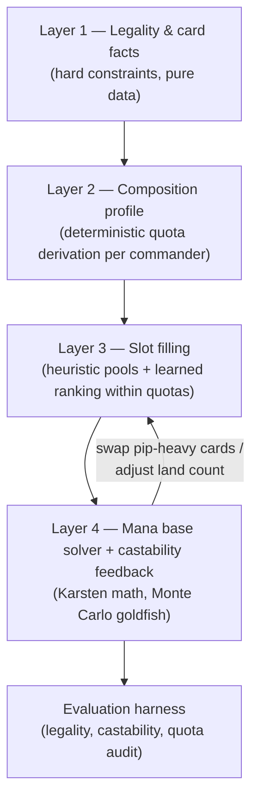

# Composition-First Deck Builder — Rebuild Plan

**Status:** draft for review · 2026-07-04
**Premise:** a human builds a deck top-down — legality constraints, then functional
quotas (lands / ramp / draw / interaction / protection), then best-in-slot card
selection.  Previous phases tried to learn deck structure bottom-up from ~94
decklists, which is spending the scarcest resource (decklist data) on facts we
can compute analytically.  This plan inverts the architecture: **deterministic
composition is the skeleton; the learned model only ranks cards within slots.**

None of the existing code is sacred, but much of it is reusable — see
[§ Disposition of existing code](#disposition-of-existing-code).

---

## Architecture

Four layers, strictly ordered.  Lower layers can never be overridden by higher
ones.



### Layer 1 — Legality & card facts (never learned, never violated)

Pure data derived from the `cards` table at build time:

- **Color identity** — every card's identity must be a subset of the
  commander's.  Already stored (`cards.color_identity`, GIN-indexed).
- **Singleton** — one copy of everything except basics.
- **Format legality** — Commander banned list.  *Data gap: verify MTGJSON
  legalities are stored; add a column if not.*
- **Mana profile per card** — parsed once at ingest, stored structured:
  - pip counts per color (`{W}{W}` → `{"W": 2}`), including hybrid/phyrexian
    handling (count as "castable via either" — see Layer 4)
  - mana value, X-spell flag
  - for lands: colors produced (`produced_mana`, already stored), enters
    tapped/untapped classification, fetch/dual/utility class
  - MDFC-land flag (counts as a fractional land in quota math)

### Layer 2 — Composition profile (deterministic, ~200 lines, fully unit-testable)

A `CompositionProfile` computed from the commander alone — before any card
selection.  Every knob is a *derivation*, not a constant:

| Quota | Derivation |
|---|---|
| `go_live_turn` | commander MV, adjusted −1 if the deck plan is "commander ahead of curve" (default for MV ≥ 4) |
| `ramp.count` | scales with commander MV: MV ≤ 2 → ~6, MV 3–4 → ~10, MV 5+ → ~12 |
| `ramp.max_mv` | must accelerate the commander: `commander_MV − 2` (a 2-MV rock helps a 4-drop; a 3-MV rock does not) |
| `lands.count` | base 37, minus credit for cheap ramp, MDFC lands, and cheap card-selection density; floor 33, ceiling 40 |
| `draw.count` | ~10; engines vs one-shots split by curve speed (aggressive low curve → more engines) |
| `interaction.spot` | ~6–8, meta-neutral default |
| `interaction.sweepers` | 2–3; +1 if the deck itself doesn't go wide (asymmetry check vs archetype) |
| `protection.count` | **commander-centricity** from decompose signals: engine/voltron commanders (signals route through the commander) → 5+; incidental-value commanders → 0–2 |
| `curve_targets` | per-MV bucket targets (evolve current `CURVE_BUCKET_MV*` tables from `deck_builder.py`) |
| `theme_slots` | whatever remains: `99 − lands − ramp − draw − interaction − protection` — typically ~30–35.  This scarcity is the discipline the old pipeline lacked. |
| `pip_thresholds` | Karsten-style colored-source minimums per color, finalized in Layer 4 after spell selection |

Commander-centricity is derivable today: `card_abilities` rows with
`source='decompose'` tell us whether the commander is an engine the deck
depends on (e.g. `token_generator` producer, combat trigger engines) or a
passive payoff.

**Output is explainable by construction** — the profile is a table of
`(quota, value, because)` triples that flows through to the API response.

### Layer 3 — Slot filling (where the ML budget is actually spent)

For each quota, build a candidate pool and rank it:

1. **Pool** — the existing staple SQL (`shared/mtg_sql/staples/`: ramp, mana
   rocks/dorks/land-ramp, removal, sweeper, draw engine/spell, interaction)
   filtered by color identity and by quota constraints (`ramp.max_mv`, curve
   bucket).  Protection needs a new pool (hexproof/indestructible grants,
   counter-backup, recursion-of-commander patterns) — add to `staples/`.
2. **Rank within pool** — Phase 1 encoder + Phase 2 bilinear head score
   each candidate against the commander.  The model chooses *which* 10 ramp
   pieces, never *how many*.
3. **Theme slots** — the only place open-ended synergy ranking runs:
   candidates from synergy edges + decompose producer/consumer SQL, ranked by
   the learned scorer, **with diminishing-returns counters** (simple category
   counters, e.g. cap on N-th sac outlet / N-th anthem) instead of a
   transformer trying to learn saturation from 94 decks.
4. **Wincon audit** — assert the theme slots contain ≥ 2–3 cards flagged
   `win_condition` (role detection exists in `services/api/ops/card_roles.py`);
   if not, force-include from a wincon pool.

### Layer 4 — Mana base solver + castability feedback loop

The mana base cannot be derived before spell selection (pips depend on the
spells), so the build is iterative:

```
select spells (L3) → pip census → solve mana base → castability check
      ↑                                                    |
      └── swap worst pip-offenders / adjust land count ←───┘   (≤ 3 iterations)
```

- **Karsten castability table** — encoded as static data:
  `(turn, pips_needed) → colored sources required for ~90% on-curve casting`.
  The commander itself is the most important row: sources must satisfy the
  commander's pips by `go_live_turn`.
- **Source counting** — a land producing a color counts as a source; fetches
  count for what they find; MDFC spell-lands count fractionally; ramp that
  fixes (e.g. Cultivate) contributes partial sources.
- **Solver** — allocate nonbasic slots from a quality-tiered land pool
  (extend `synergy/staples/land_tags.py` + `manabase.py`), then distribute
  basics to satisfy per-color source minimums, not just pip *ratio*
  (ratio-only allocation — the current `deck_builder.py` approach — under-serves
  splash colors with mandatory early plays).
- **Monte Carlo goldfisher** — simulate opening hands + draws + land drops +
  ramp: report `P(commander cast by go_live_turn)`, `P(color screw by turn 3)`,
  keepable-hand rate.  This is both the feedback signal for the loop and the
  primary evaluation metric.

---

## Disposition of existing code

| Asset | Disposition |
|---|---|
| `cards` schema (color_identity, produced_mana, mana_cost, cmc) | **Keep** — Layer 1 mostly exists; add structured pip parse + legality if missing |
| `shared/mtg_sql/staples/*` | **Keep & extend** — becomes the Layer 3 pool source; add `protection`, `wincon` pools |
| `services/trainer/deck_builder.py` | **Promote & rewrite** — it is v0 of Layers 2–4 (fixed 36 lands, curve buckets, role targets, pip-ratio basics).  Becomes the core package, not a trainer post-processor |
| `stages/decompose.py` + `synergy/commander_mechanics.py` | **Keep** — feeds commander-centricity (L2) and theme pools (L3) |
| Phase 1 `CardEncoder` + embeddings | **Keep** — the similarity space is the within-slot ranker's foundation |
| Phase 2 `BilinearSynergyHead` | **Keep** — relation-aware within-slot ranking |
| Phase 3 `CommanderScorer` | **Retire (park the checkpoint)** — docs already question its marginal value; within-quota ranking removes its job |
| Phase 4 transformer / 30–70 inference blend | **Retire** — deck-level coherence is now Layers 2–4; `train.py` in this checkout no longer exposes phase 4 anyway |
| `ops/inference.py` candidate scoring | **Repurpose** — becomes the L3 ranking service behind a new `/build` endpoint |
| `ops/card_roles.py` role detection | **Keep** — wincon audit + role census |
| Ingest pipeline (download/embed/tag/synergy/export) | **Keep** — unchanged except new Layer-1 card-facts stage |
| UI Deck Builder tab | **Rewrite** — displays the composition profile + per-slot "because" explanations |

---

## Workstreams

Ordered so each lands independently testable value.  W1–W3 need no GPU and no
retraining.

### W1 — Card facts (Layer 1 data)
New ingest stage `compute_card_facts` (or extend `tag_mechanics`):
structured pip parse, hybrid/phyrexian handling, land classification
(ETB-tapped detection, fetch targets, produced colors), MDFC flags, legality
column check.  Stored in a new `card_facts` table (or JSONB column).
**Done when:** every Commander-legal card has a mana profile; golden tests on
~50 tricky cards (hybrid, phyrexian, MDFC, X-spells, fetches).

### W2 — Composition engine (Layer 2)
New pure-Python package `services/composition/` (importable by API *and*
scripts; no DB, no torch): `profile.py` (quota derivation), `karsten.py`
(castability tables).  Input: commander card facts + decompose signals.
**Done when:** golden tests assert sane profiles for a reference set —
e.g. Wilhelt (MV 4 → ~10 ramp @ MV ≤ 2, moderate protection),
Yisan (MV 3 engine → high protection), Krenko (MV 4 go-wide → fewer sweepers),
a 2-MV commander (→ ~6 ramp, more theme slots).

### W3 — Builder loop + mana base solver (Layers 3–4, heuristic ranking first)
Rewrite `deck_builder.py` as `services/composition/builder.py` with the
iterative pip-feedback loop, per-color *source minimums*, and the Monte Carlo
goldfisher (`goldfish.py`).  First version ranks within pools by simple
heuristics (staple tier, curve fit) so the whole system works **before** any
model is wired in — this is the baseline the ML must beat.
**Done when:** for 20 reference commanders the builder emits legal 99-card
decks with `P(commander by go_live_turn) ≥ 0.85` and all quota audits passing.

### W4 — Learned ranking within slots
Wire Phase 1 + Phase 2 scoring into pool ranking; theme-slot selection with
diminishing-returns counters.  A/B against the W3 heuristic baseline on the
evaluation harness.
**Done when:** model-ranked decks match the heuristic baseline on castability
metrics and beat it on theme coherence (human spot-check + synergy-edge
density of the theme slots).

### W5 — API + UI
`POST /commanders/{oracle_id}/build` returning deck + composition profile +
per-slot explanations; rewrite the Deck Builder tab around the quota table
("36 lands because avg MV 3.1; 10 ramp @ ≤2 MV because commander costs 4…").
Deck persistence keeps the existing `generated_decks` flow.

### W6 — Evaluation harness as a first-class artifact
`services/composition/eval/`: legality check, quota audit, goldfish metrics,
and *sanity* comparison against imported human decks (quota distributions
should overlap human ranges — human decks validate the template, they are not
the target).  Runs in CI on the golden commander set.

---

## Sequencing & risks

```
W1 ──► W2 ──► W3 ──► W4 ──► W5
                │
                └──► W6 (starts alongside W3, grows continuously)
```

- **W1–W3 are pure Python + SQL** — fast iteration, no GPU machine involved.
- **Risk: pip parsing edge cases** (hybrid, phyrexian, X, split cards) — mitigate
  with the golden-card test set in W1 before anything depends on it.
- **Risk: quota derivations are opinionated** — mitigate by making every
  constant a named parameter in one module (`profile.py`) with the "because"
  string next to it, and validating distributions against human decks in W6.
- **Risk: theme-slot quality is where the old system was weakest** — W4 keeps
  the heuristic baseline permanently available (`?ranking=heuristic`) so model
  regressions are always visible.
- **Open question:** partner commanders (two-card color identity union) —
  handle in W2 or explicitly defer; the import pipeline also still skips
  single-slash partners (TODO.md).

## Retraining implications

W1–W3 and W5–W6 require **no retraining** — that is the point of the design.
W4 uses existing checkpoints (`phase1_best.pt`, `phase2_bilinear_best.pt`)
as-is.  Only if W4 later motivates retraining the bilinear head on cleaned,
color-filtered edges would the sequence be: re-run ingest `--stage process` →
`export_dataset` → download on GPU machine → retrain Phase 1/2 → upload both
checkpoints.  Phases 3–4 are retired and never retrained.
