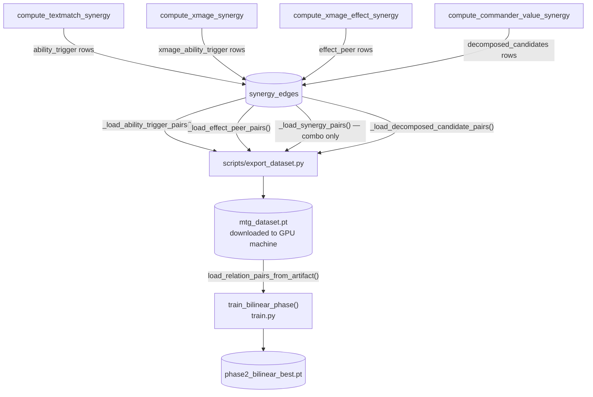

# Training notes

## Phase 2 — bilinear loss benchmarks

Phase 2 uses **asymmetric InfoNCE** per relation, not symmetric NT-Xent.  The
random ceiling is `ln(batch_size)` (asymmetric form, not `ln(2 × batch_size)`).

| batch_size | Random ceiling | Barely learning | Good | Excellent | Overfit risk |
|-----------|---------------|-----------------|------|-----------|--------------|
| 256 | ln(256) ≈ 5.55 | > 5.2 | 3.5 – 5.0 | 2.0 – 3.5 | < 2.0 |
| 512 | ln(512) ≈ 6.24 | > 6.0 | 4.0 – 5.5 | 2.5 – 4.0 | < 2.5 |

The reported loss is averaged across all active relations each epoch.  Individual
relations converge at different rates: `effect_peer` typically converges fastest
(symmetric functional equivalence is the cleanest signal); `decomposed_candidates`
converges slowest (directed commander → card relevance is a harder task).

The encoder is **frozen** throughout Phase 2 bilinear — there is no temperature
annealing and no encoder drift to monitor.  Verify Phase 1 geometry is intact
after training with `eval_neighbors.ps1 -Checkpoint phase1_best`.

To fall back to the old NT-Xent encoder-update path:
```powershell
.\scripts\run.ps1 -Train 2 -Bilinear:$false
```

> **Historical note:** NT-Xent benchmarks (`ln(2 × batch_size)` ceiling) and BCE
> benchmarks (loss in [0, 1]) documented in earlier commits are no longer
> applicable to the default bilinear training path.

## Phase 4 — encoder stability

The encoder is unfrozen by default but runs at `lr * encoder_lr_scale` (default
0.1×) to protect Phase 3 representations.  Pass `-FreezeEncoder true` in
`run.ps1` to freeze entirely.  `patience=10` halts training if loss does not
improve for 10 consecutive epochs.  Score compression (cosine similarity → 1.0
across all pairs) indicates the encoder has been over-updated; reduce
`encoder_lr_scale` or freeze.

## Land embeddings

`services/ingest/land_tags.py` prepends structured tags to every Land card's
oracle text before embedding (fetch, dual, shock, check, etc. cycles; penalty
tags for tapped/sacrifice).  If `land_tags.py` changes, delete and re-embed:

```bash
docker compose exec db psql -U mtg -d mtg -c "
  DELETE FROM card_embeddings
  WHERE card_id IN (
    SELECT e.card_id FROM card_embeddings e
    JOIN cards c ON c.id = e.card_id
    WHERE c.type_line ILIKE '%Land%'
  );"
docker compose run --rm ingest python pipeline.py --stage embed_cards
docker compose run --rm ingest python pipeline.py --stage export_dataset
```

Changing land embeddings invalidates all checkpoints — retrain from Phase 1.

## Training artifacts

| Phases | Artifact | Checkpoints produced |
|--------|----------|----------------------|
| 1 | `mtg_dataset.pt` | `phase1_best.pt` — CardEncoder |
| 2 (bilinear) | `mtg_dataset.pt` | `phase2_bilinear_best.pt` — BilinearSynergyHead |
| 3–4 | `mtg_commanders.pt` | `phase3_best.pt` / `phase4_best.pt` — CommanderScorer |

Phase 3 loads the encoder from `phase1_best.pt` (not `phase2_best.pt`, which is
only written by the legacy NT-Xent path).

```powershell
.\scripts\download_dataset.ps1      # downloads mtg_dataset.pt (Phases 1-2)
.\scripts\download_commanders.ps1   # downloads mtg_commanders.pt (Phases 3-4)

.\scripts\run.ps1 -Train 1
.\scripts\run.ps1 -Train 2          # bilinear (default); use -Bilinear:$false for NT-Xent
.\scripts\run.ps1 -Train 3
.\scripts\run.ps1 -Train 4
```

## Commander artifact (`mtg_commanders.pt`)

The commander artifact enables Phase 3 BPR training **without human decklists**,
avoiding the representation-collapse failure mode where all commanders converge
toward an indistinct high-similarity cluster because they all need the same
generic roles (draw, ramp, removal).

**How it works:** `export_dataset_commanders.py` reads directly from `synergy_edges`
— no JSON intermediate required.  For each legal commander two edge types contribute
positives: `ability_trigger` edges (producers of the commander's trigger → commander)
and `commander_value` edges (commander → payoff cards).  Color-identity legality is
re-applied strictly (⊆) in Python.  The result is a per-commander positive set that
is genuinely distinct from other commanders', giving BPR a meaningful gradient.

```bash
# Requires compute_textmatch_synergy and compute_commander_value_synergy to have been run.
docker compose run --rm ingest python pipeline.py --stage export_dataset_commanders

# Or call directly:
docker compose run --rm ingest python -m scripts.export_dataset_commanders
```

| Env var | Default | Purpose |
|---------|---------|---------|
| `COMMANDERS_OUTPUT` | `/data/mtg_commanders.pt` | Output artifact path |
| `COMMANDERS_MIN_POS` | `10` | Skip commanders with fewer producer cards |
| `COMMANDERS_MAX_POS` | `300` | Cap per-commander positives (shuffle + truncate) |

The artifact schema is identical to `mtg_dataset.pt` for the `decks` key
(`commander_idx`, `card_idxs`, `color_identity`, `legal_neg_indices`, `archetype`)
so the existing `DeckDataset` and `train_deck_phase` in `train.py` work unchanged.
The `archetype` field contains the top-5 most frequent `trigger_event` values from
the commander's edges (e.g. `"creature_etb, death_trigger, tribal_zombie_typeline"`).

---

# Phase 2 bilinear — relation types (`BilinearSynergyHead`)

Phase 2 trains one `W_r` matrix per relation type using asymmetric InfoNCE.
Each relation type has distinct semantics; keeping them separate prevents
contradictory gradients that would corrupt Phase 1 embedding geometry.

## Relation types

| Relation | Semantics | Source in artifact | Direction |
|---|---|---|---|
| `effect_peer` | Functional equivalence — cards that do the same thing | `effect_peer` key | symmetric |
| `ability_trigger` | Producer → consumer — card A enables card B's trigger | `ability_trigger` key | directed |
| `combo` | Game-state interaction — cards that win together | `synergy` key (label > 0.5) | undirected |
| `decomposed_candidates` | Commander → deck candidate — card B fits A's strategy | `decomposed_candidates` key | directed |

At inference, `score_candidates()` uses the `decomposed_candidates` W_r matrix
to score how well each candidate fits a given commander, blended with the Phase 3
`CommanderScorer` score (default weight 30% bilinear / 70% scorer).  Tune via
`bilinear_weight` in `inference.py:score_candidates()`.

**Limitation of W_decomposed_candidates:** it is a single 256×256 matrix applied
uniformly to every (commander, card) pair.  It learns a global answer to "does
this card's embedding sit in a useful directional relation to this commander's
embedding?" but cannot specialise per commander archetype.  A Prossh embedding
and an Atraxa embedding pass through the same W.  The Phase 3 `CommanderScorer`
MLP sees `[z_cmd; z_card]` jointly and is trained with BPR on per-commander
positive/negative sets, giving it the per-commander discrimination that a single
matrix structurally cannot represent.

**When Phase 3 may be redundant:** if the synergy candidate pre-filter is already
selecting the high-synergy cards and the bilinear signal generalises well, the
CommanderScorer may only re-rank within a pool that is already well-ordered.
Validate empirically: compare the top-20 candidates for several commanders scored
by bilinear alone vs. bilinear + CommanderScorer.  If the ranking does not change
meaningfully, the commanders artifact pipeline is doing the real work and Phase 3
is not earning its compute.

## How relation pairs flow into training



## Updating pairs for an existing relation

After any ingest-side change that affects a relation's edges, re-export and
retrain:

```bash
# On the Docker host — re-run the relevant synergy stage, then re-export
docker compose run --rm ingest python pipeline.py --stage compute_textmatch_synergy
docker compose run --rm ingest python pipeline.py --stage export_dataset

# On the GPU machine
.\scripts\download_dataset.ps1
.\scripts\run.ps1 -Train 2          # retrains bilinear head from phase1_best
```

Phase 2 bilinear does not update the encoder, so Phase 1 does **not** need to be
re-run when only relation pair data changes.

## Adding a new relation type

**Step 1 — ingest side:** produce the new edge rows in `synergy_edges` (or a new
table) and export them as a new key in `mtg_dataset.pt`.

  a. Add the ingest logic in the relevant `stages/` module.

  b. In `export_db_helpers.py`, add a `_load_<relation>_pairs()` function that
     queries the new rows and returns `(a_idx, b_idx)` numpy arrays.

  c. In `export_dataset.py` → `main()`:
     - Call the new loader.
     - Add the key to the `artifact` dict: `"<relation>": {"a_idx": ..., "b_idx": ...}`.
     - Update `meta` counts and the log line.

**Step 2 — training side:**

  a. Add the relation name to `BilinearSynergyHead.RELATIONS` in **both**:
     - `services/trainer/train.py`
     - `services/api/ops/model.py`

     Position in the list determines the index stored in checkpoints — always
     append to the end; never reorder existing entries, or all saved W_r
     matrices will be misaligned.

  b. In `load_relation_pairs_from_artifact()` (`train.py`), add a block that
     reads the new artifact key and appends to `result`.

**Step 3 — verify:**

```powershell
# Spot-check that the new relation loads correctly and has enough pairs
.\scripts\run.ps1 -Train 2 -Epochs 1 -Dataset .\ingest_cache\mtg_dataset.pt
# Look for: "Phase 2 bilinear: <relation> → N pairs"
# N must be >= batch_size (default 512) for the relation to be active
```

> **Checkpoint compatibility:** adding a relation appends a new `W[i]` entry to
> the `ParameterList`.  Old checkpoints (fewer relations) load cleanly via
> `strict=False` — the new W_r starts from identity.  Removing or reordering
> relations breaks all existing checkpoints and requires retraining from Phase 2.
